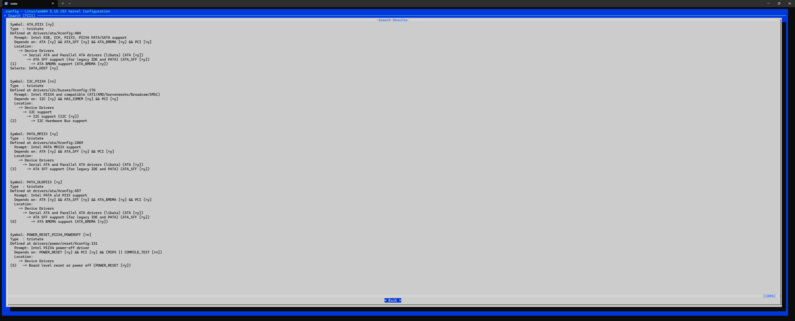

# Build Gem5 Patched Linux Kernel for Full-System Simulation

> Last edited by Haoyuan Ma, `03:53 P.M. 25th April UTC+8`

Kernel source and build instructions are located at [Starfive Gem5 Linux](http://gitlab.starfivetech.com/sag/starfive_gem5_linux.git)

Currently I have only built and tested for Linux Kernel v4.15.

**Important Note: DO NOT USE gcc version later than 7 to build the linux kernel < 4.15. You may encounter problems even if the build is successful**

Official Documentation says vanilla Linux kernel can also be used to boot the Gem5 simulation. I have tested and verified that Linux mainline kernel `5.15` can boot and mount the disk successfully in `Gem5`. But pay attention, you need to enable several drivers to be built into the kernel mannually based on general `arm64` defconfig:

**Pay attention to `PIIX` related configurations in the figure above**

Btw, we can quickly verify the kernel and disk image by using `QEMU Direct Kernel Boot`. For how to build `QEMU`, refer to `build_qemu.md`; For how to boot and verify with `QEMU`, refer to `qemu_direct_kernel_boot.md`